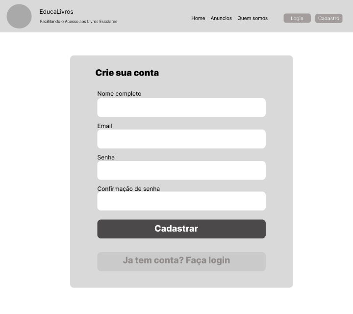

# Projeto de Interface

Pré-requisitos: <a href="2-Especificação do Projeto.md"> Documentação de Especificação</a>

Visão geral da interação do usuário pelas telas do sistema e protótipo interativo das telas com as funcionalidades que fazem parte do sistema (wireframes).

 Apresente as principais interfaces da plataforma. Discuta como ela foi elaborada de forma a atender os requisitos funcionais, não funcionais e histórias de usuário abordados nas <a href="2-Especificação do Projeto.md"> Documentação de Especificação</a>.

## Diagrama de Fluxo

As referências abaixo irão auxiliá-lo na geração do artefato “Diagramas de Fluxo”.

> **Links Úteis**:
> - [Fluxograma online: seis sites para fazer gráfico sem instalar nada | Produtividade | TechTudo](https://www.techtudo.com.br/listas/2019/03/fluxograma-online-seis-sites-para-fazer-grafico-sem-instalar-nada.ghtml)

## Wireframes

Abaixo podem ser visualizados os wirframes de tolas as telas previstas no sistema. Caso prefira, pode acessar a versão interativa através do link:

- [EducaLivros - Wireframe Interativo](https://www.figma.com/proto/H3OU6AnfsqjSQkUY60Dpqp/EducaLivros-Wireframe?type=design&node-id=3-72&t=m96yDdyi525sNd5l-0&scaling=scale-down&page-id=0%3A1&starting-point-node-id=3%3A72)

### Home Page - visitante

### Home Page - usuário logado

### Tela de cadastro

